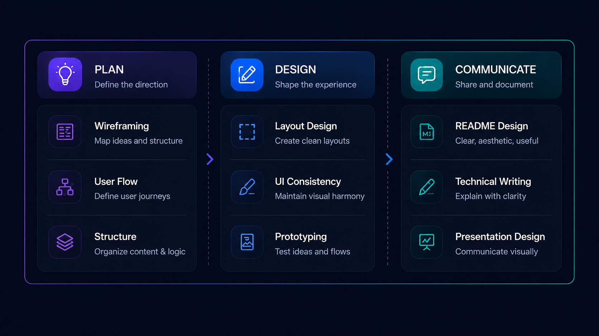
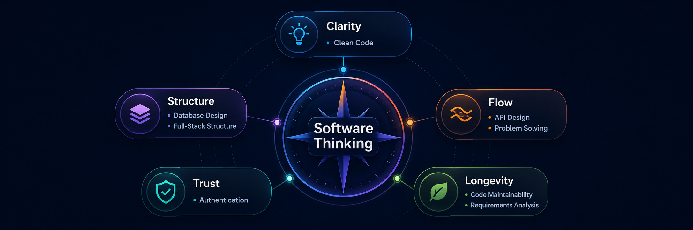
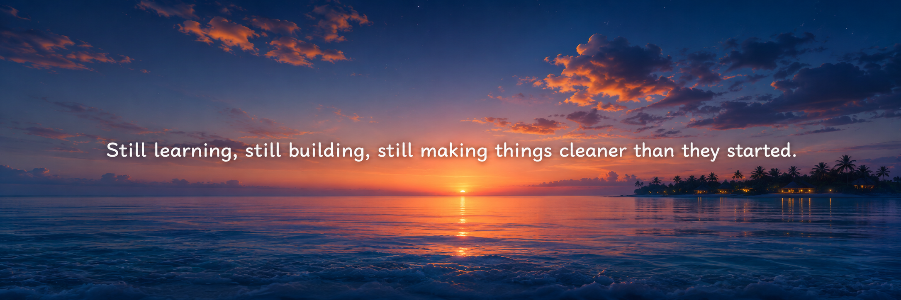

 

 

## Hey, I'm Mohamed Usaidh

Mo for short.

I’m a CS student from the Maldives, currently based in Kuala Lumpur, Malaysia. I like taking small ideas, breaking them apart, and shaping them into software that feels cleaner, simpler, and more useful than where it started.

I’m still learning, still experimenting, and still figuring things out one build at a time.

---

## The Way I Build

I enjoy the part of software where messy ideas slowly become clear systems. For me, good software is not only about making something work. It should also be understandable, useful, and easier to improve later.

---

## Toolkit

### Core Stack

---

### Currently Learning

---

### Tools I Use

---

### Visual & Documentation Skills

I care about how ideas are presented, not just how they are built. This section reflects the design, structure, and communication skills I use to make projects easier to understand, use, and share.

---

### The Details I Care About

These are the details I try to keep in mind while building — the things that make software clearer, stronger, easier to maintain, and more useful beyond the first version.

---

## Get in Touch

Open to internship opportunities, collaboration, or just a good tech conversation.

---

