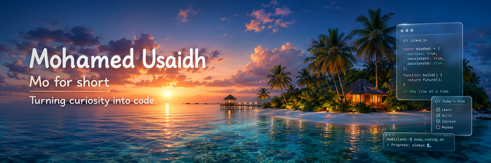
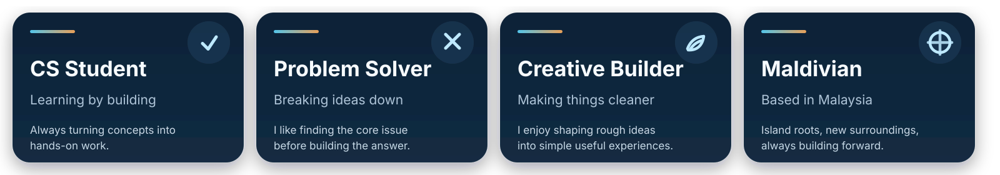
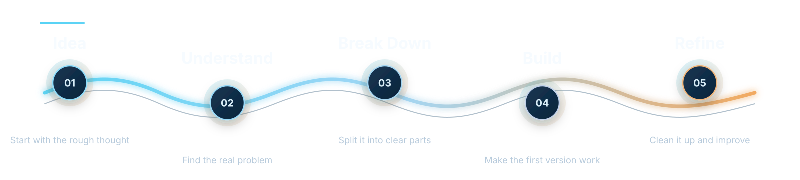
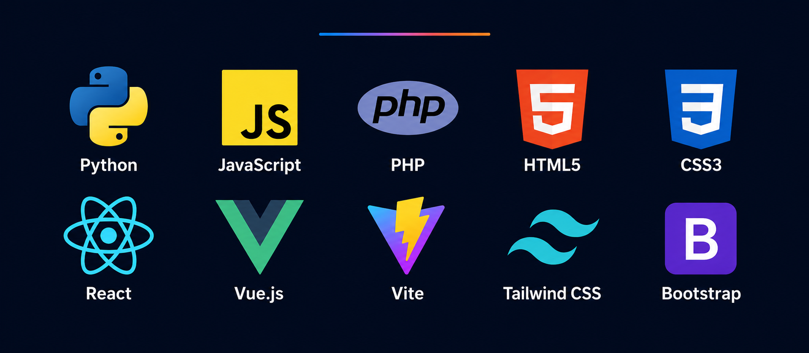
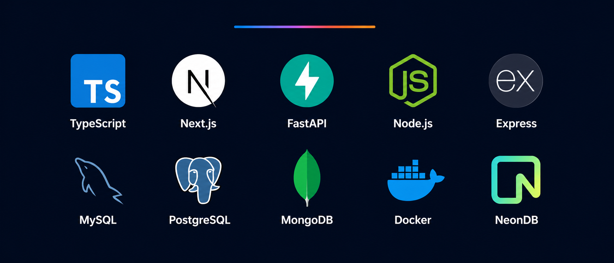
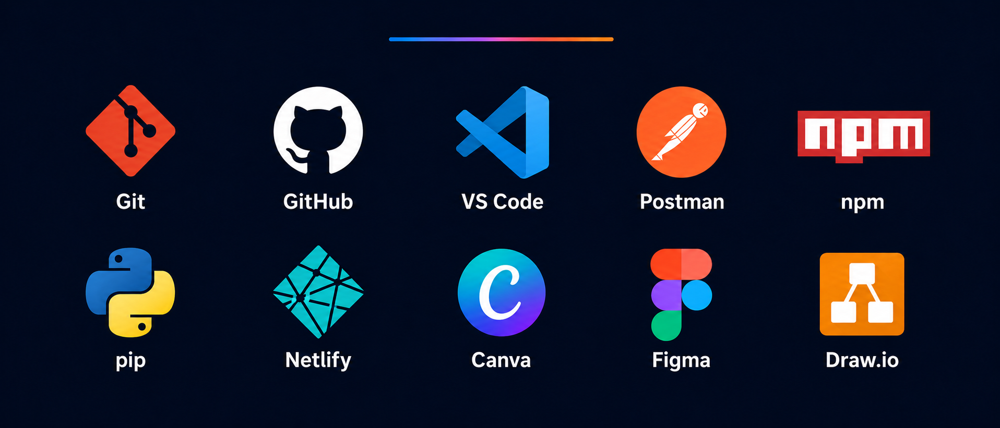

 

 

## Hey, I'm Mohamed Usaidh

Mo for short.

I’m a CS student from the Maldives, currently based in Kuala Lumpur, Malaysia. I like taking small ideas, breaking them apart, and shaping them into software that feels cleaner, simpler, and more useful than where it started.

I’m still learning, still experimenting, and still figuring things out one build at a time.

---

## The Way I Build

I enjoy the part of software where messy ideas slowly become clear systems. For me, good software is not only about making something work. It should also be understandable, useful, and easier to improve later.

---

## Toolkit

### Core Stack

---

### Currently Learning

---

### Tools I Use

---

### Creative Workflow

<table>
  <tr>
    <td align="center" width="170"><b>Wireframing</b></td>
    <td align="center" width="170"><b>Prototyping</b></td>
    <td align="center" width="170"><b>Layout Design</b></td>
    <td align="center" width="170"><b>README Design</b></td>
  </tr>
  <tr>
    <td align="center" width="170"><b>Presentation Design</b></td>
    <td align="center" width="170"><b>UI Consistency</b></td>
    <td align="center" width="170"><b>Technical Writing</b></td>
    <td align="center" width="170"><b>Documentation</b></td>
  </tr>
</table>

---

### Concepts I Care About

<table>
  <tr>
    <td align="center" width="180"><b>Clean Code</b></td>
    <td align="center" width="180"><b>Problem Solving</b></td>
    <td align="center" width="180"><b>Database Design</b></td>
    <td align="center" width="180"><b>API Design</b></td>
  </tr>
  <tr>
    <td align="center" width="180"><b>Authentication</b></td>
    <td align="center" width="180"><b>Code Maintainability</b></td>
    <td align="center" width="180"><b>Requirements Analysis</b></td>
    <td align="center" width="180"><b>Full-Stack Structure</b></td>
  </tr>
</table>

---

## Connect

---

<b>Still learning, still building, still making things cleaner than they started.</b>

